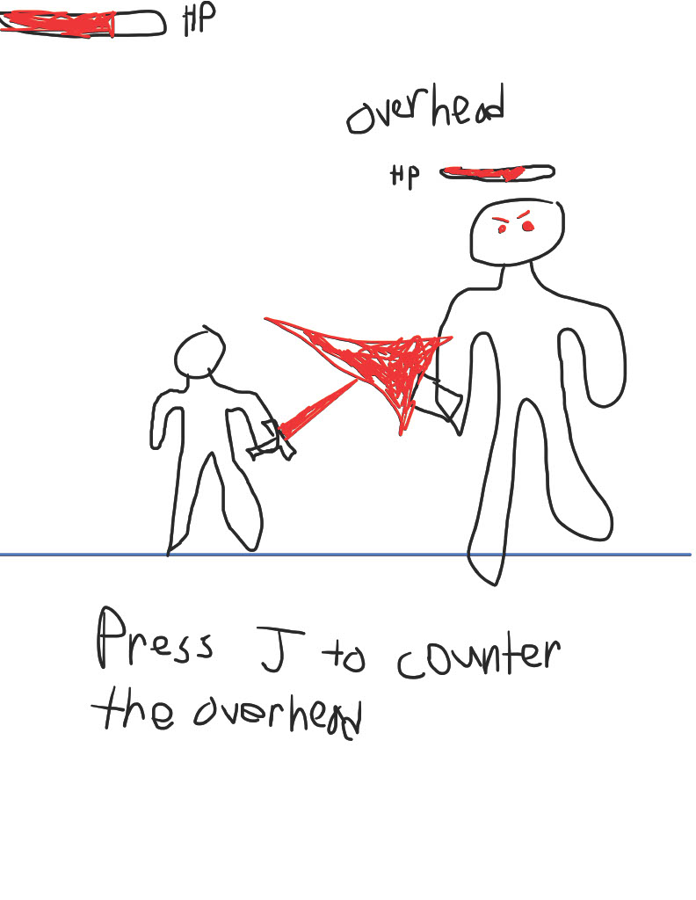

:warning: Everything between << >> needs to be replaced (remove << >> after replacing)

# The Last Vanguard
## CS110 Final Project  Fall, 2024 

## Project Description
    The player will control a swordsman who is capable of performing 3 different attack (overhead, slash, uppercut). The player however can only input these attacks after the enemy swordsman randomly performs one. The player is to input whatever attack the enemy performs in order to "counter" the attack and avoid damage. If they counter successfully the enemy will recieve damage, and if they fail the player will take damage. The enemy will survive 10 hits and then the player will move on to the next level where the enemy gets faster. There are an infinite amount of levels, and the player is to survive as many levels as possible. Inputting J will let the player "slash". Inputting "K" will let the player "overhead". Inputting "L" will let the player "uppercut".

## GUI Design

### Initial Design

### Final Design

## Program Design

    list classes move these to features
playable character
game over screen
NPCs
Progressive increase in difficulty
Health Points
Respawning NPCs
Auido indicators
Levels

### Features

1. << Feature 1 >>
2. << Feature 2 >>
3. << Feature 3 >>
4. << Feature 4 >>
5. << Feature 5 >>

### Classes

- Player: The class that creates the character the person playing the game will control. Has 3 attacks (slash, overhead, stab) to use to counter an enemy attack. It controls sound effects the player creates and the players animations.  
- Enemy: The class that creates the enemy chaarcter. This class randomly selects one of the 3 attacks and animates the enemy to perform the attack. It controls sound effects created by the character

## ATP

    Test Case 1: Player Damage
        - Test Description: Verify that the player will lose HP and play an audio cue indicating this
        - Test Steps:
            1. Start the game
            2. Press nothing
            3. After enemy attack look at HP on the top left corner and verify a change.
            4. after enemy attack verify a grunt sound is played
        - Expected Outcome: The HP value in the top left should decrease by 10 and a grunt should be heard

    Test Case 2: Successful Counter
        - Test Description: Verify that the player will successfully counter an enemy slash
        - Test Steps:
            1. Start the game
            2. Wait for enemy slash
            3. Input "J" once enemy slashes
            4. Verify a "hit" sound is played for the enemy
            5. Verify the player performs a slash
            6. Verify the HP on the top right decreases by 10
        - Expected Outcome: The player should perform a slash attack leading to a hit audio cue and a decrease the enemys HP

    Test Case 3: Player Death
        - Test Description: Verify that when the player dies a game over screen appears
        - Test Steps:
            1. Start the game
            2. Press nothing 
            3. Wait for the player HP to drop to 0
            4. Verify that once this happens the screen goes to black and says "Game Over" while still displaying the level
        - Expected Outcome: The screen will go to black and display game over with the level the player reached

    Test Case 4: Failed Counter
        - Test Description: Verify that the player fails a counter properly 
        - Test Steps:
            1. Start the game
            2. Wait for an enemy overhead or uppercut
            3. Input "J"
            4. Verify a grunt sound is played
            5. Verify the player performs a slash
            6. Verify the players HP decreases by 10
        - Expected Outcome: The player will perform a slash, therefore failing the counter and taking damage

    Test Case 5: Enemy Death
        - Test Description: Verify that the enemy despawns and the level increases
        - Test Steps:
            1. Start the game
            2. Play the game and counter successfully until enemy HP reaches 0
            3. Verify that when the enemy despawns an audio cue prompting the end of the level is played
            4. Verify the enemy despawns for 4 seconds
            5. Verify that when the enemy respawns the level increases by 1
            6. Verify that when the enemy respawns the enemy HP is reset back to 100
        - Expected Outcome: The enemy should despawn and play an audio cue indicating the end of the level, and respawn afte 4 seconds with full health and on the next level. 